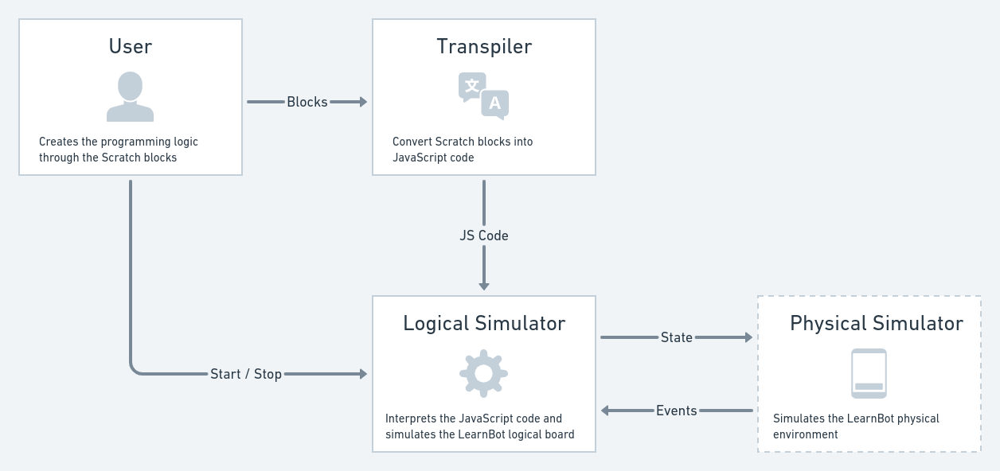

# LearnBot Simulation Protocol

The LearnBot Simulation Protocol aims to standardize the communication between the [Logical Simulator](#logical-simulator) ([PiCode](https://picode.com.br) side) and the [Physical Simulator](#physical-simulator) ([Oorbit](https://oorbit.com.br) side) during the LearnBot simulation.

The image below illustrates the simulation flow


## Logical Simulator

The [Logical Simulator](#logical-simulator) mimics the LearnBot behaviour by interpreting the code generated by the user (after being transpiled) and sending [state messages](#state-message) to the [Physical Simulator](#physical-simulator) so it can show its effects to the user.

## Physical Simulator

The [Physical Simulator](#physical-simulator) simulates the physical LearnBot board wich may have external components attached to it. It also interacts with users by giving them an way to setup the physical environment and interact with its sensors. When any changes that may affect the simulation state happen, an [event message](#event-message) must be sent to the [Logical Simulator](#logical-simulator).

## State

The simulation state is managed by the [Logical Simulator](#logical-simulator) and upon changes an [state message](#state-message) is sent to the [Physical Simulator](#physical-simulator).

### State Message

The [state message](#state-message) contains information about the current simulation state. For simplicity, the message (see below) is represented in the YAML format. However, the actual implementation is a JavaScript Object.

```yaml
simulation:
  type: LearnBot v1.2
  status: running # running or stopped
  loading: 0.951 # (95.1%) 0 to 1
  error: 0 # see error codes
  mode: 3D # 3D or AR

board:
  position: [0, 0] # x and y position

  components:
    builtin:
      inputs:
        temperature: 0.253 # 0 to 1
        ldr: 0.485 # 0 to 1
        button_0: 0 # 0 or 1 (B0)
        button_1: 1 # 0 or 1 (B1)
        button_2: 1 # 0 or 1 (B2)
        button_3: 0 # 0 or 1 (B3)
        button_4: 1 # 0 or 1 (BT2)
        switch_led_rgb: 0 # 0 or 1
        switch_servo_motor: 1 # 0 or 1

      outputs:
        buzzer: 0.000 # 0 to 1 (0 to 20KHz)
        led_0: 0.521 # 0 to 1  (pin 9)
        led_1: 0.200 # 0 to 1 (pin 10)
        led_2: 0.076 # 0 to 1 (pin 11)
        led_3: 1 # 0 or 1 (pin 12)
        led_4: 0 # 0 or 1 (pin 13)
        led_rgb: [0.021, 0.795, 0.003] # R, G and B are numeric values ranging from 0 to 1
        led_power: 1 # 0 or 1

    external:
      inputs:
        ultrasonic:
          value: 0.474 # 0 to 1
          trigger_pin: 7 # 7 or 8
          echo_pin: 8 # 7 or 8
          position: [632, 495] # x and y position

      outputs:
        servo_motor_0:
          value: 0 # 0 to 1
          signal_pin: -1 # 3 or 11
          position: null # not in place

        servo_motor_1:
          value: 0.212 # 0 to 1
          signal_pin: 11 # 3 or 11
          position: [128, 227] # x and y position

        dc_motor_0: # MA
          speed: 0.671 # 0 to 1 (pin 5)
          direction: 0 # 0 or 1 (clockwise or counter-clockwise)
          positive_pin: 9 # 9 or 10
          negative_pin: 10 # 9 or 10
          position: [-1295, 780] # x and y position

        dc_motor_1: # MB
          speed: 1.000 # 0 to 1 (pin 6)
          direction: 1 # 0 or 1 (clockwise or counter-clockwise respectively)
          positive_pin: 12 # 4 or 12
          negative_pin: 4 # 4 or 12
          position: [522, -879] # x and y position
```

### Simulation status

The [simulation status](#simulation-status) could be one of the following:

- `running` - The simulation is being executed
- `stopped` - Restart the simulation to the initial values and waits until it's running again

### Simulation mode

The [simulation mode](#simulation-mode) could be one of the following:

- `3D` - Components positions are considered
- `AR` - Components positions are ignored

Note that in `3D` mode, components whose position is null have their values set default (i.e. `<value_name>: 0`).

### Component position

The board and the external components have an additional property called **position** which holds information about their tridimensional coordinates.

For the board and for those components that are in place, the position format is as follows:

```yaml
position: [x_coordinate, y_coordinate]
```

And for those components that are **not** in place, the position value is **null**:

```yaml
position: null
```

Given the fact that the component doesn't moves in the **z axis**, just two values in the position array are enough.

### Initial Values

For input and output fields, the initial value is 0. For component pins the initial value is -1 (disconnected). And for the external component position, the inital value is null wich means _"not in place"_ when running in **3D** mode.

The simulation starts at the **stopped** state with the loading progress set to 0 and mode set to **3D**.

### Error codes

The application may be in a failure state that is represented by one of the following codes:

| Code | Description        |
| ---- | ------------------ |
| 800  | Server maintenance |
| 801  | Invalid URL        |
| 802  | Invalid user       |
| 803  | Blocked account    |
| 804  | Access not found   |
| 805  | Expired access     |
| 806  | Limit reached      |
| 807  | Access denied      |
| 808  | Invalid access     |

If there is no error, the simulation error code is 0.

## Events

Events are managed by the [Physical Simulator](#physical-simulator) and upon changes a message in the [state message](#state-message) or [event message](#event-message) format is sent to the [Logical Simulator](#logical-simulator).

### Event Message

The [event message](#event-message) contains information about simulation state properties that has been changed. For simplicity, the message (see below) is represented in the YAML format. However, the actual implementation is a JavaScript Object.

```yaml
# optional
simulation:
  type: LearnBot v1.2
  status: running # running or stopped
  loading: 0.951 # (95.1%) 0 to 1
  error: 0 # see error codes
  mode: AR

# optional
board:
  position: [35, -128] # x and y position

  components:
    - name: button_1
      type: builtin
      value: 1 # 0 or 1

    - name: switch_servo_motor
      type: builtin
      value: 0 # 0 or 1

    - name: servo_motor_0
      type: external
      signal_pin: 3 # 3 or 11
      position: [-435, 88]

    - name: ultrasonic
      type: external
      value: 0.474 # 0 to 1
      trigger_pin: 7 # 7 or 8
      echo_pin: 8 # 7 or 8
      position: [2409, 397]
```
